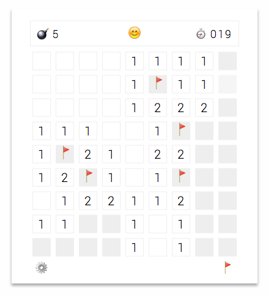

# minesweeper
The most complete minesweeper game built with React, Redux and Immutable.js.

[Play Now!](https://kevin940726.github.io/minesweeper)



---

### Features

**Working Progress...**

- [x] Custom game board and three different major difficulty.
- [x] Counting Time.
- [x] Mines left.
- [x] Set flags.
- [x] Quick mode and mode switch.
- [x] Settings save in cookie.
- [x] Generate non-guessing game.

### How to Play
Seriously !?

### Build
git clone this project, then.
```bash
cd minesweeper
npm install
npm start
```
Head to [localhost:8000](localhost:8000).

### API
You can find the logic of the game in `./src/minesweeper.js`. If you don't like the UI or you want to make a enhancement, import it to your custom UI.

```js
import Minesweeper, { Block, BlockRecord } from './src/minesweeper.js';
```

#### `Block`:
An immutable Record store in each block. Check out [immutable.js](https://facebook.github.io/immutable-js/) for methods.

```js
const Block = Record({
    type: 'normal',
    mines: 0,
    hidden: true,
    flag: false
});
```

#### `BlockRecord`:
An immutable Record indicate the row and column of the block.

```js
const BlockRecord = Record({
	row: 0,
	col: 0
});
```

#### `Minesweepr()`:
Create the game board, load initial data. There are some game data you can get:

- `rows`: _(Int)_ Game board rows.
- `cols`: _(Int)_ Game board columns.
- `mines`: _(Int)_ Game board mines.
- `minesRemaining`: _(Int)_ How many mines left without flagged.
- `blocks`: _(Immutable Map)_ An immutable Map data for each blocks in the game board.
- `status`: _(String)_
	* `ready`: Ready to play the game before first click.
	* `playing`: Playing the game after first click.
	* `win`: Clear the game board without hitting mines.
	* `lose`: Hit a mine.
- `timePass`: _(Int)_ Current time pass in the game.
- `mode`: _(String)_
	* `regular`: Regular game mode. Single click to reveal the block, right click to set a flag.
	* `quick`: Quick mode. Single click to set a flag, while right click will reveal the block.
- `flagMode`: _(Boolean)_ Quick mode for the game or not

```js
const game = Minesweeper();
```

#### `Minesweepr::reset(rows, cols, mines, quickMode)`:
Clear the game board and reset the config settings. Return `blocks`.

#### `Minesweepr::init(rows, cols, mines, quickMode, exclude)`:
Reset and start the game. The `exclude` take an array of `BlockRecord` to exclude from being mine. Return `blocks`.

#### `Minesweeper::singleClick(BlockRecord)`:
Perform a single click on a block. Set a flag if `mode` === `quick`, else reveal the block. Return a Promise with `blocks` as argument.

#### `Minesweeper::rightClick(BlockRecord)`:
Perform a right click on a block. Reveal the block if `mode` === `quick`, else set a flag. Return a Promise with `blocks` as argument.

### TODO

- [ ] Record high score.
- [x] Cleverly first click init.
- [ ] Mobile friendly.
- [x] Game solver (_hard_, for non-guessing game).
- [ ] Completely switch to Immutable.js.
- [ ] Increase solver speed.
- [ ] Cover up loading screen.

### Contribute
Issues, PRs, and all the advise and discussion are very welcome!

### Special Thanks

- [muan/emoji](https://github.com/muan/emoji): Great cross-platform emoji collection!
- [Solving Minesweeper with Matrices By Robert Massaioli](https://massaioli.wordpress.com/2013/01/12/solving-minesweeper-with-matricies/): Awesome and inspiring minesweeper solver algorithm.

### License
[MIT](./LICENSE)
